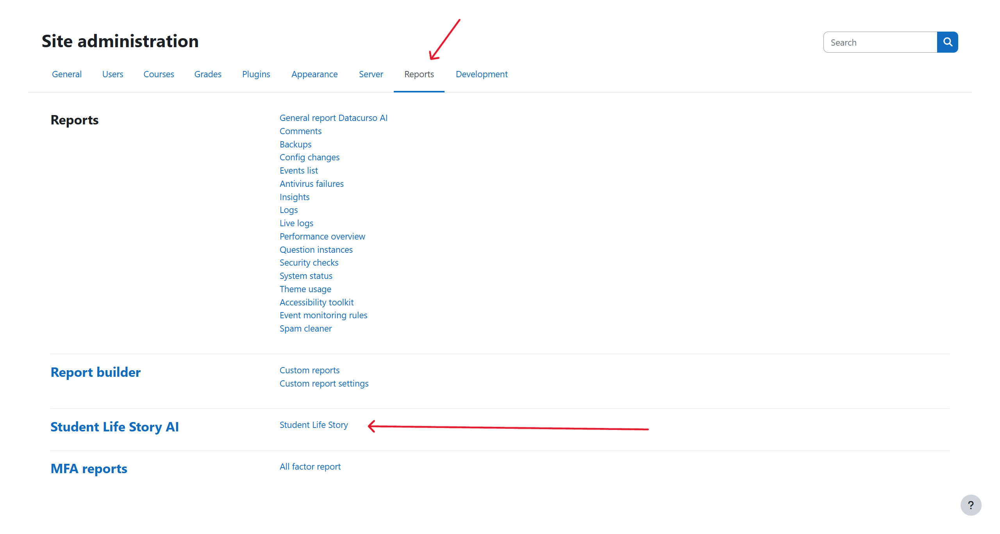
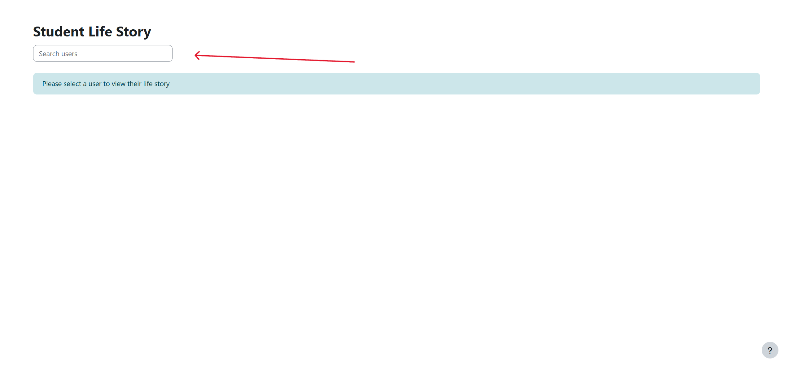
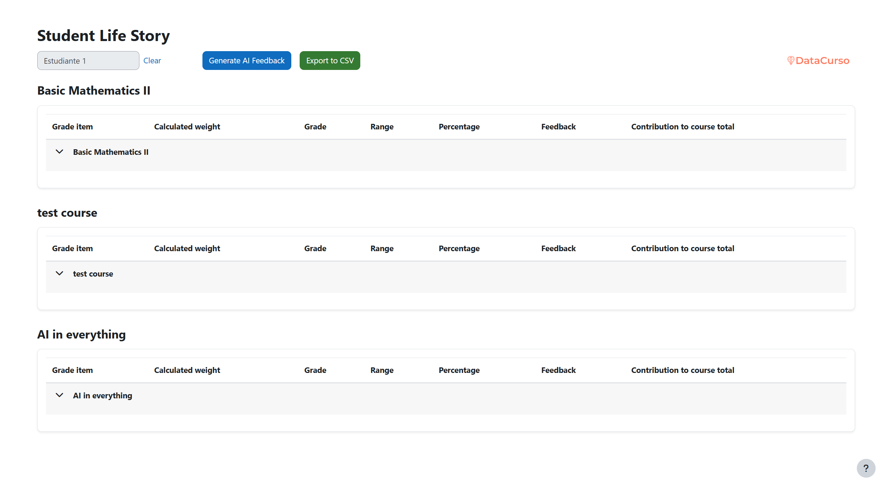
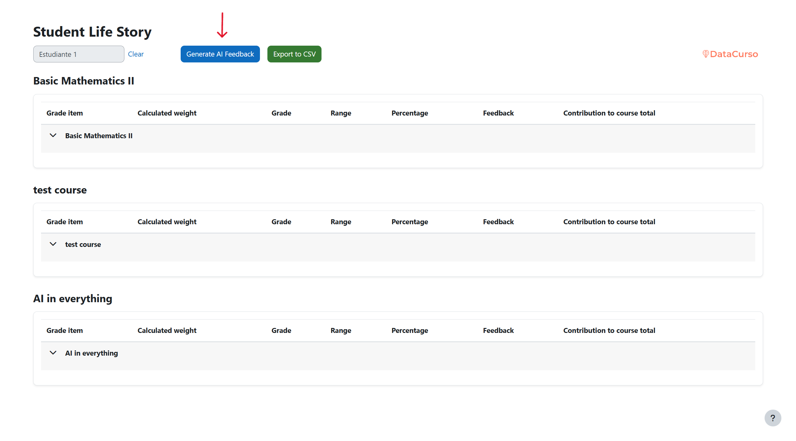
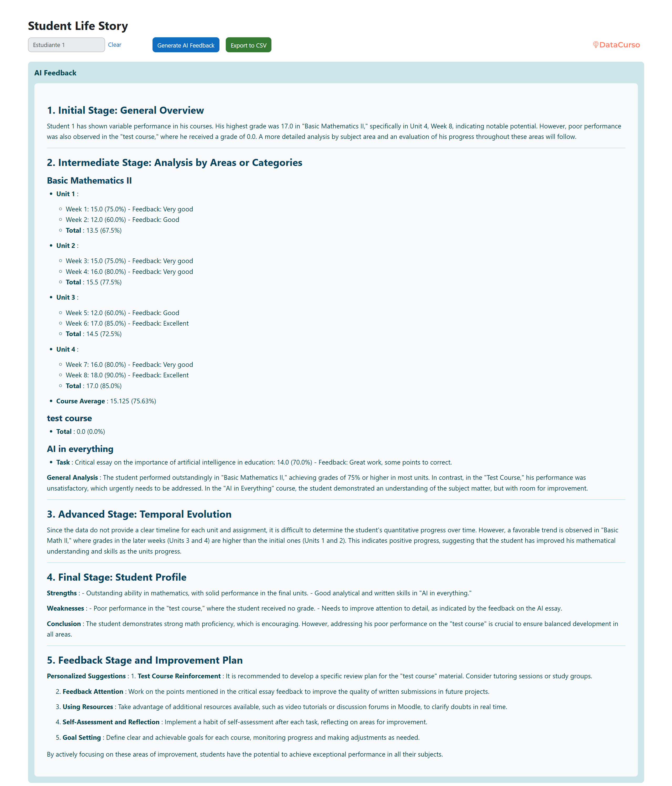

## Student Life Story AI

This plugin will help you review your students' life histories and, with the help of artificial intelligence, see their performance.

## Pre-requisites

1. Have at least PHP version 8.1 installed on the server.

2. Have Moodle version 4.1.14 or higher, up to version 4.5.

## Installation via uploaded ZIP file

1. Log in to your Moodle site as an administrator and go to Site `Administration > Plugins > Install Plugins`.
2. Upload the ZIP file with the plugin code. You'll only be prompted to add additional details if the plugin type isn't automatically detected.
3. Check the plugin validation report and complete the installation.

## Manual installation

The plugin can also be installed by placing the contents of this directory in

`{your/moodle/dirroot}/report/student_life_story_ai`

Next, log in to your Moodle site as an administrator and go to Site `Administration > General > Notifications` to complete the installation.

Alternatively, you can run

```bash
php admin/cli/upgrade.php
```

to complete the installation from the command line.

## Enter the plugin

Enter site administration and then reports.



## Search student

In the field you can write the student's name or email.



## Plugin View

Here, the plugin shows us all the courses the student is enrolled in, a button to generate feedback, and a button to export to CSV.



## Button Generate AI Feedback

1. This button is used to send the student's data to the artificial intelligence so that it can give us feedback.

   

2. This is the view when the feedback has already been generated.
   
   

## Button CSV

This button generates a CSV with the student's data so that the data can be used freely.


