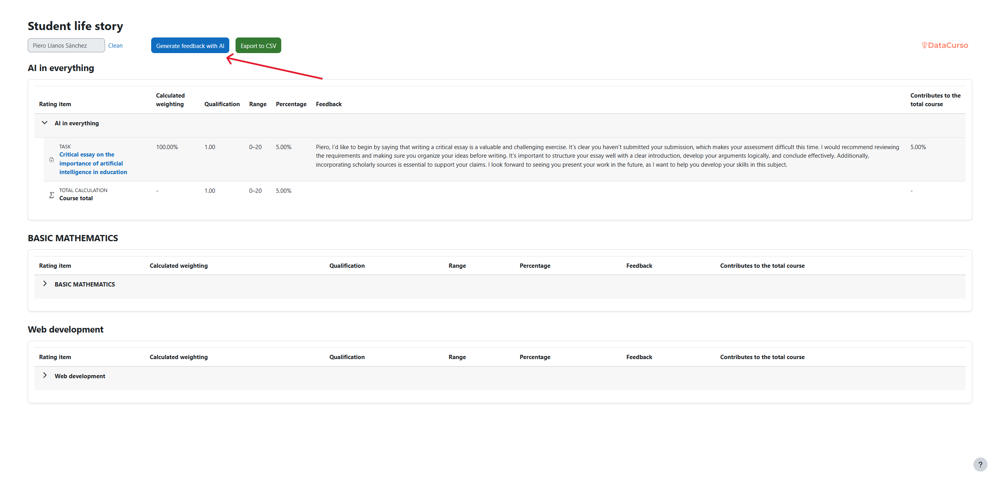

## Student Life Story AI

The Student Life Story AI plugin consolidates, in a single view, the entire academic trajectory of each student within Moodle. It analyzes their grades, participation, and progress across all enrolled courses, providing a comprehensive overview of their learning journey.

Using artificial intelligence, the plugin automatically generates a narrative report that interprets the student’s performance over time and suggests personalized improvement actions.
This AI-driven approach allows educators, tutors, and academic coordinators to understand not only what a student’s results are, but also why those results occur and how to enhance their learning outcomes.

The system combines quantitative data (grades, percentages, progress) with qualitative interpretation generated by AI, transforming raw data into actionable academic insights.

## Pre-requisites

1. Moodle 4.5
2. Install the Moodle AI provider "DataCurso AI Provider". Download it for free from [https://moodle.org/plugins/aiprovider_datacurso/versions](https://moodle.org/plugins/aiprovider_datacurso/versions).
3. In the DataCurso AI Provider settings, configure a valid license key as documented at [https://docs.datacurso.com/index.php?title=Datacurso_AI_Provider#Getting_license_keys](https://docs.datacurso.com/index.php?title=Datacurso_AI_Provider#Getting_license_keys).

**IMPORTANT**: This plugin will not function unless the "DataCurso AI Provider" plugin is installed and licensed.

## Installation via uploaded ZIP file

1. Log in to your Moodle site as an administrator and go to Site `Administration > Plugins > Install Plugins`.
2. Upload the ZIP file with the plugin code. You'll only be prompted to add additional details if the plugin type isn't automatically detected.
3. Check the plugin validation report and complete the installation.

## Manual installation

The plugin can also be installed by placing the contents of this directory in

`{your/moodle/dirroot}/report/lifestory`

Next, log in to your Moodle site as an administrator and go to Site `Administration > General > Notifications` to complete the installation.

Alternatively, you can run

```bash
php admin/cli/upgrade.php
```

to complete the installation from the command line.

## Enter the plugin

Once installed, access the plugin by navigating to:

```bash
Site Administration > Reports > Student Life Story AI
```

From this section, you can search for students, review their complete learning history, generate AI-based feedback, and export structured data for further analysis.


## Search student

Use the search field to locate a specific student by name or email address.
The plugin will instantly display all the courses the student is enrolled in, along with academic data such as grades, progress, and completion rates.


This consolidated view eliminates the need to manually navigate through individual courses and provides a single access point for understanding each student’s academic evolution.

## Plugin View

The main interface of the plugin provides a structured summary of each student’s academic record, including:

- A list of all enrolled courses and corresponding progress indicators.

- A Generate AI Feedback button that sends the student’s academic data to the AI system for analysis.

- A CSV Export button that allows users to download all relevant information for offline or institutional reporting.


Through this view, teachers and coordinators can monitor student performance, compare historical trends, and identify strengths or areas for improvement.

## Button Generate AI Feedback

The “Generate AI Feedback” button activates the artificial intelligence engine to analyze the student’s performance data and produce an interpretive narrative report.

1. When pressed, the system collects relevant academic information — such as grades, course completion rates, and participation metrics — and sends it securely to the DataCurso AI Provider for processing.

   

2. Once the analysis is complete, the plugin displays a clear, structured feedback view, showing the AI-generated text. This narrative describes the student’s academic evolution, highlights strengths and weaknesses, and provides concrete recommendations for improvement.

   

## Button CSV

The CSV export button allows administrators and teachers to generate a downloadable file containing all the student’s consolidated data.


